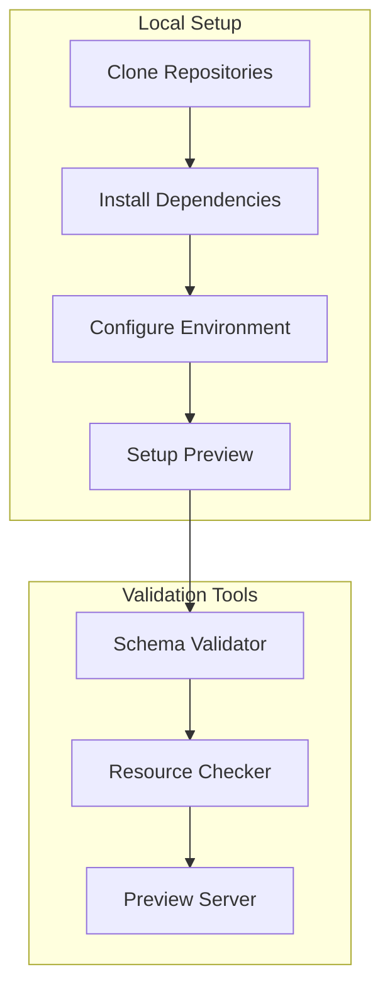
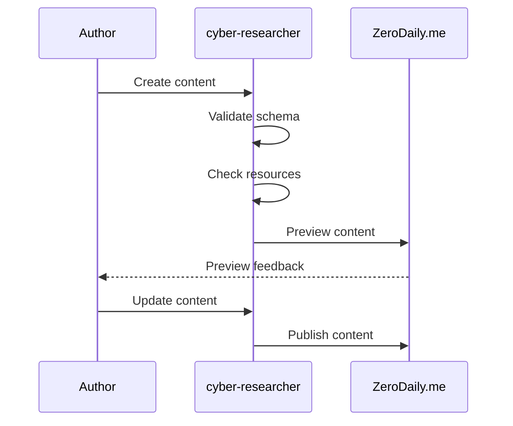
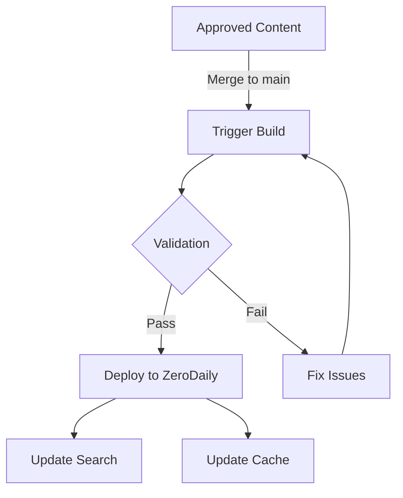

# Development Workflow

This document outlines the development workflow for content creation and platform integration between cyber-researcher and ZeroDaily.me repositories.

## Development Environment Setup



## Repository Structure

```
cyber-researcher/           # Content Repository
├── .docs/                 # Shared documentation
├── content/              # Published content
├── drafts/              # Work in progress
└── resources/           # Shared resources

zerodaily.me/             # Platform Repository
├── .docs/               # Shared documentation
├── src/                # Platform source code
└── content/            # Imported content
```

## Development Workflow

### 1. Content Creation



#### Steps:
1. Create new branch in cyber-researcher
2. Use appropriate template
3. Add content and resources
4. Run local validation
5. Preview in ZeroDaily.me
6. Address feedback
7. Submit for review

### 2. Content Review

#### Technical Review
- Schema compliance
- Resource validation
- Technical accuracy
- Code examples
- Security considerations

#### Editorial Review
- Content quality
- Style guide compliance
- Metadata accuracy
- Resource completeness

### 3. Publication Process



## Local Development

### Setup Commands

```bash
# Clone repositories
git clone <cyber-researcher-repo>
git clone <zerodaily-repo>

# Install dependencies
cd cyber-researcher
yarn install

cd ../zerodaily
yarn install

# Start preview server
yarn preview
```

### Validation Commands

```bash
# Schema validation
yarn validate:schema

# Resource check
yarn validate:resources

# Full validation
yarn validate:all
```

## Preview Environment

### Local Preview
1. Start preview server
2. Create/edit content
3. View at localhost:3000
4. Check responsive design
5. Verify resource loading

### Preview Features
- Live reload
- Error highlighting
- Resource validation
- Mobile preview
- Search testing

## Continuous Integration

### Pull Request Checks
- Schema validation
- Resource verification
- Link checking
- Preview deployment
- Type checking

### Automated Tests
- Schema compliance
- Resource availability
- Build verification
- Integration tests

## Release Process

### Content Release
1. Complete review process
2. Merge to main branch
3. Trigger build
4. Verify deployment
5. Check analytics

### Platform Updates
1. Update schema if needed
2. Test with sample content
3. Deploy platform changes
4. Verify content display
5. Monitor performance

## Troubleshooting

### Common Issues

#### Schema Validation Errors
```yaml
# Example error
error: Invalid frontmatter
file: example-post.mdx
field: tags
message: Must include at least 2 tags
```

**Resolution:**
1. Check schema requirements
2. Update frontmatter
3. Re-run validation

#### Resource Errors
```
error: Missing resource
file: technical-guide.mdx
resource: /images/diagram.png
```

**Resolution:**
1. Verify resource path
2. Add missing resource
3. Update reference

#### Preview Issues
```
error: Preview build failed
reason: Invalid import
file: component.tsx
```

**Resolution:**
1. Check build logs
2. Update dependencies
3. Fix import paths

## Best Practices

### Content Development
1. Use feature branches
2. Regular validation checks
3. Meaningful commit messages
4. Update documentation
5. Test all resources

### Code Quality
1. Follow style guides
2. Document changes
3. Write clear commits
4. Add tests
5. Review thoroughly

### Communication
1. Clear PR descriptions
2. Update status regularly
3. Document decisions
4. Share knowledge
5. Report issues early

## Support

### Getting Help
- Repository issues
- Documentation
- Team chat
- Regular meetings

### Contributing
1. Read guidelines
2. Follow templates
3. Test thoroughly
4. Document changes
5. Request reviews

## Monitoring

### Content Health
- Validation status
- Resource availability
- Build success
- Preview status

### Platform Health
- Build status
- Deploy success
- Performance metrics
- Error rates

## Security

### Content Security
- No sensitive data
- Secure resources
- Valid links
- Safe examples

### Platform Security
- Access control
- Data validation
- Resource limits
- Error handling
