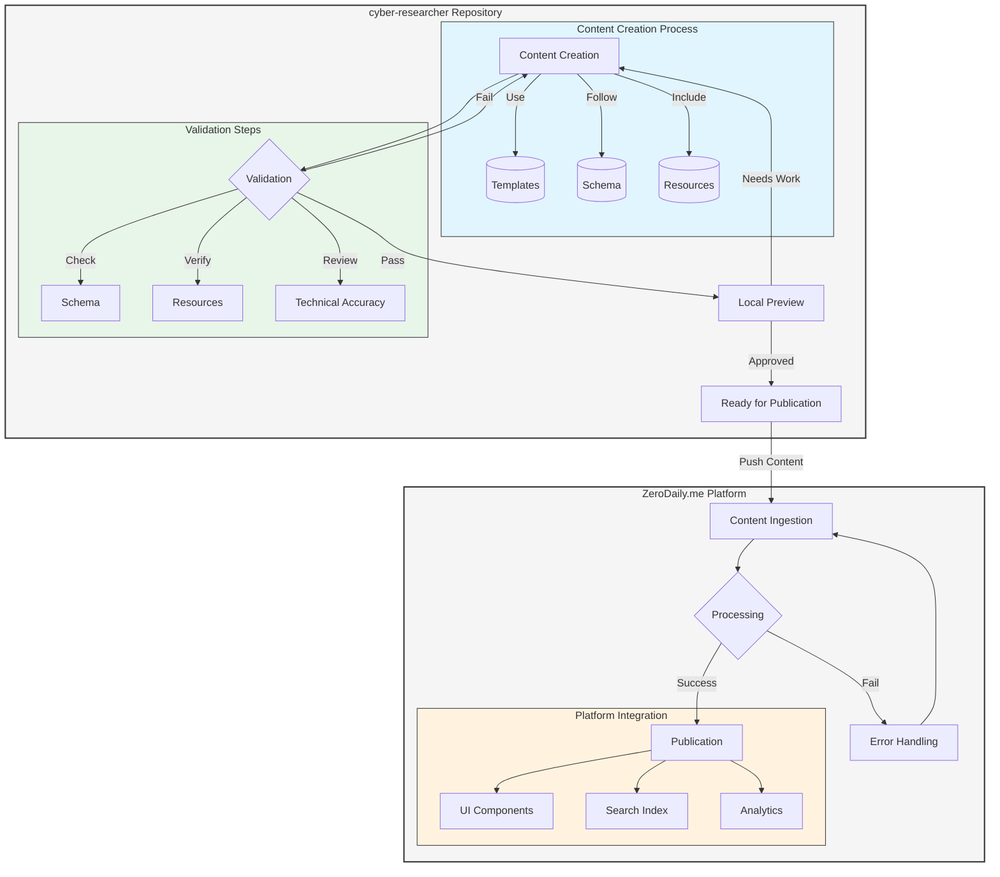

# Content Pipeline

This document describes how content flows from cyber-researcher to ZeroDaily.me.

## Content Flow Overview

## Pipeline Stages

### 1. Content Creation (cyber-researcher)
- Use templates from `.docs/templates`
- Follow frontmatter schema
- Include all required fields
- Add necessary resources

### 2. Validation (cyber-researcher)
- Schema validation
- Resource link verification
- Content quality checks
- Technical accuracy review
- Verification date tracking (using `last_verified_date` for playbooks, tool guides, etc.)

### 3. Preview (cyber-researcher)
- Local content preview
- Format verification
- Mobile responsiveness
- Resource accessibility

### 4. Publication (ZeroDaily.me)
- Content ingestion
- Metadata processing
- Index updates
- Cache management

### 5. Platform Integration (ZeroDaily.me)
- UI component mapping
- Search index updates
- Related content linking
- Analytics integration

## Content Types and Handling

### Blog Posts
1. **Creation**
   - Use appropriate template
   - Follow style guide
   - Include required assets

2. **Validation**
   - Frontmatter compliance
   - Resource verification
   - Technical accuracy
   - Verification date tracking (`last_verified_date` for verifiable content)

3. **Publication**
   - Schedule or immediate
   - Author notification
   - Social media integration

### Resources
1. **Creation**
   - Follow resource templates
   - Include necessary metadata
   - Link related content

2. **Validation**
   - Resource availability
   - Link verification
   - Format compliance

3. **Publication**
   - Resource indexing
   - Access control
   - Version tracking

## Error Handling

### Common Issues
1. **Schema Validation**
   - Invalid frontmatter
   - Missing required fields (including `last_verified_date` for verifiable content)
   - Invalid field values

2. **Resource Issues**
   - Broken links
   - Missing assets
   - Invalid paths

3. **Content Problems**
   - Formatting errors
   - Incomplete sections
   - Technical inaccuracies

### Resolution Process
1. Automated validation feedback
2. Error reporting to authors
3. Fix verification
4. Re-validation

## Development Workflow

### Local Development
1. Clone both repositories
2. Set up local preview
3. Create/edit content
4. Test and validate

### Testing
1. Run schema validation
2. Check resource links
3. Preview content
4. Verify metadata

### Deployment
1. Content validation
2. Resource verification
3. Publication scheduling
4. Platform integration

## Monitoring and Maintenance

### Content Health
- Regular validation runs
- Link checking
- Resource verification
- Schema compliance
- Content verification tracking (using `last_verified_date`)

### Performance Metrics
- Content processing time
- Error rates
- Publication success
- Resource availability

## Integration Points

### cyber-researcher
- Content creation
- Validation rules
- Preview functionality
- Resource management

### ZeroDaily.me
- Content ingestion
- Platform integration
- UI/UX implementation
- Analytics tracking

## Best Practices

1. **Content Creation**
   - Follow templates strictly
   - Include all required metadata
   - Verify resources locally
   - Test before submission

2. **Validation**
   - Run all checks locally
   - Address all warnings
   - Verify resource links
   - Check technical accuracy
   - Update `last_verified_date` for playbooks, tool guides, compliance mappings, and framework implementations

3. **Publication**
   - Schedule appropriately
   - Monitor publication
   - Verify platform display
   - Check analytics integration

## Troubleshooting

### Common Problems
1. **Validation Failures**
   - Check schema compliance
   - Verify field values
   - Review resource links

2. **Preview Issues**
   - Check local setup
   - Verify resource paths
   - Review formatting

3. **Publication Errors**
   - Check platform status
   - Verify content format
   - Review error logs

### Support
- Report issues in respective repositories
- Follow issue templates
- Include relevant logs
- Provide reproduction steps
