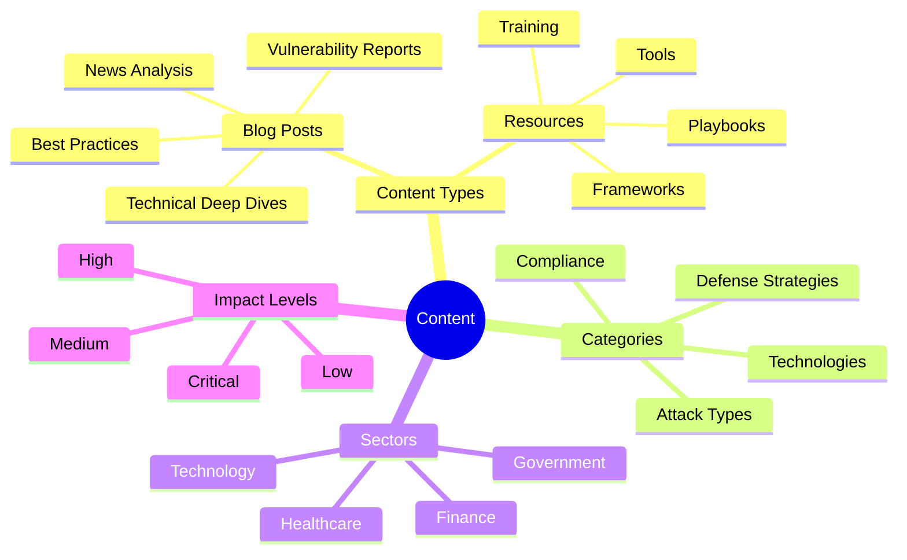
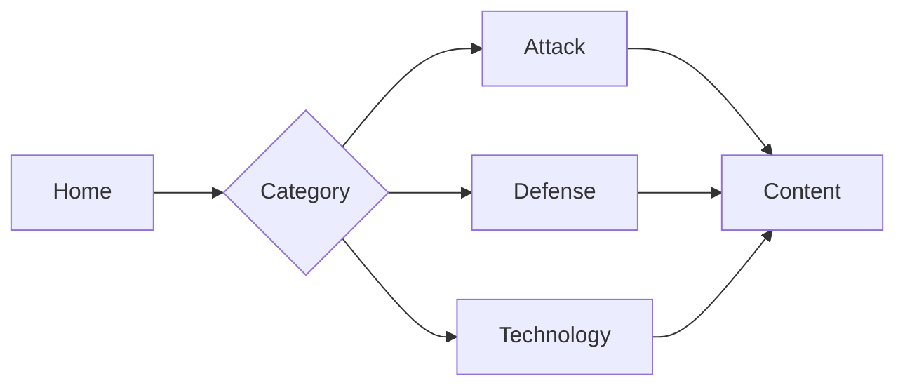

# Content Taxonomies

This document defines the standardized taxonomies used across cyber-researcher and ZeroDaily.me for content categorization and organization.

## Overview



## Content Types

### Blog Posts

| Type | Description | Use Case |
|------|-------------|----------|
| news-analysis | Breaking security news and analysis | Current events, breaches |
| vulnerability-analysis | CVE and vulnerability reports | Security advisories |
| technical-deep-dive | In-depth technical content | Architecture, implementation |
| best-practices | Security guidelines and standards | Implementation guides |

### Resources

| Type | Description | Use Case |
|------|-------------|----------|
| playbooks | Step-by-step response guides | Incident response |
| frameworks | Security framework documentation | Compliance, architecture |
| tools | Security tool documentation | Implementation |
| training | Educational materials | Skill development |

## Tags

### Primary Categories

```typescript
type PrimaryTag =
  | 'attack'      // Attack techniques and methods
  | 'defense'     // Defense strategies
  | 'compliance'  // Regulatory and standards
  | 'technology'  // Technical implementations
  | 'process'     // Procedures and workflows
  | 'tools'       // Security tools and platforms
```

### Attack Types

```typescript
type AttackTag =
  | 'malware'
  | 'ransomware'
  | 'phishing'
  | 'social-engineering'
  | 'supply-chain'
  | 'zero-day'
  | 'ddos'
  | 'injection'
  | 'authentication'
  | 'encryption'
```

### Defense Categories

```typescript
type DefenseTag =
  | 'monitoring'
  | 'detection'
  | 'prevention'
  | 'response'
  | 'recovery'
  | 'hardening'
  | 'patching'
  | 'training'
  | 'architecture'
  | 'devsecops'
```

### Technology Stack

```typescript
type TechnologyTag =
  | 'cloud'
  | 'network'
  | 'endpoint'
  | 'mobile'
  | 'iot'
  | 'container'
  | 'serverless'
  | 'database'
  | 'api'
  | 'web'
```

## Affected Sectors

```typescript
type Sector =
  | 'technology'    // Tech companies, software
  | 'finance'       // Banks, fintech, insurance
  | 'healthcare'    // Hospitals, medical devices
  | 'government'    // Public sector, agencies
  | 'retail'        // E-commerce, retail
  | 'manufacturing' // Industrial, production
  | 'energy'        // Utilities, power
  | 'education'     // Schools, universities
  | 'telecom'       // Communications
  | 'transportation'// Logistics, travel
```

## Impact Levels

```typescript
type ImpactLevel = {
  level: 'critical' | 'high' | 'medium' | 'low';
  criteria: {
    scope: string;      // Impact breadth
    severity: string;   // Potential damage
    urgency: string;    // Response timing
  };
}
```

### Impact Criteria

| Level | Scope | Severity | Urgency |
|-------|-------|----------|----------|
| Critical | Multiple sectors/global | Significant damage/data loss | Immediate response |
| High | Single sector/regional | Major disruption | 24-48 hours |
| Medium | Limited scope/local | Moderate impact | Week or less |
| Low | Minimal scope | Minor impact | Routine handling |

## Usage Guidelines

### 1. Tag Selection

```yaml
# Example frontmatter
tags:
  - attack          # Primary category
  - ransomware      # Attack type
  - detection       # Defense category
  - cloud           # Technology
```

### 2. Sector Assignment

```yaml
affected_sectors:
  - technology      # Primary affected
  - finance         # Secondary impact
  - healthcare      # Additional impact
```

### 3. Impact Assessment

```yaml
impact_level: 'critical'
impact_details:
  scope: 'Global supply chain'
  severity: 'Data breach'
  urgency: 'Immediate patching required'
```

## Validation Rules

1. **Tags**
   - Minimum: 2 tags
   - Maximum: 5 tags
   - Must include one primary category
   - Must be from approved list

2. **Sectors**
   - Minimum: 1 sector
   - Maximum: 3 sectors
   - Order by impact priority

3. **Impact Level**
   - Required for all content
   - Must match criteria
   - Include justification

## UI Considerations

### 1. Navigation



### 2. Filtering

- Primary category filters
- Sector-based filtering
- Impact level sorting
- Technology stack filters

### 3. Search

- Tag-based search
- Sector filtering
- Impact level filtering
- Combined filters

## Analytics Integration

### 1. Tracking

- Category popularity
- Sector interest
- Impact level distribution
- Tag combinations

### 2. Insights

- Popular categories
- Sector trends
- Impact patterns
- Content gaps

## Maintenance

### 1. Reviews

- Quarterly taxonomy review
- Usage pattern analysis
- New category proposals
- Deprecation planning

### 2. Updates

- Document changes
- Update validation
- Migrate content
- Update UI

## Version Control

Track taxonomy changes in both repositories:

```yaml
version: '1.0.0'
last_updated: '2025-03-16'
changelog:
  - version: '1.0.0'
    date: '2025-03-16'
    changes:
      - 'Initial taxonomy structure'
      - 'Defined primary categories'
      - 'Added sector classifications'
      - 'Established impact levels'
```
