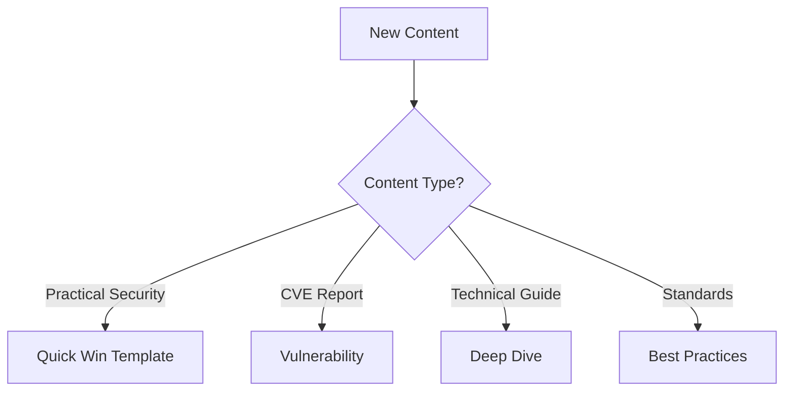

# Template Documentation

This directory contains templates for creating practical, immediately useful security content. Each template is designed to help authors create content that delivers real value to readers quickly.

## Template Structure

```text
shared/templates/
├── quick-win-template.md  # Main template for practical content
└── README.md            # Template documentation
```

## Teams and Templates

### Security Research Team

#### Focus
Practical security content creation

#### Template
`quick-win-template.md`

#### Required Tags
`practical-security`, `quick-win`

#### Validation
Must include implementation steps and verification

### Technical Analysis Team

#### Focus
In-depth technical analysis

#### Template
`technical-deep-dive.mdx`

#### Required Tags
`deep-dive`, `technical`

#### Validation
Must include difficulty level and prerequisites

## Template Details

### Quick Win Template (`quick-win-template.md`)

#### Purpose
Practical security content creation

#### Additional Fields

```yml
# Additional fields
implementation_steps: string[]
verification_steps: string[]
troubleshooting_tips: string[]
```

#### Key Sections

*   Implementation Steps
*   Verification
*   Troubleshooting

## Template Usage Flow



## Template Style Guide

### Template Styles

| Template | Style | Tone | Technical Level |
|----------|-------|------|-----------------|
| Quick Win | Concise | Informative | Mixed |
| Vulnerability | Detailed | Technical | High |
| Deep Dive | Comprehensive | Educational | Very High |
| Best Practices | Structured | Authoritative | Mixed |
