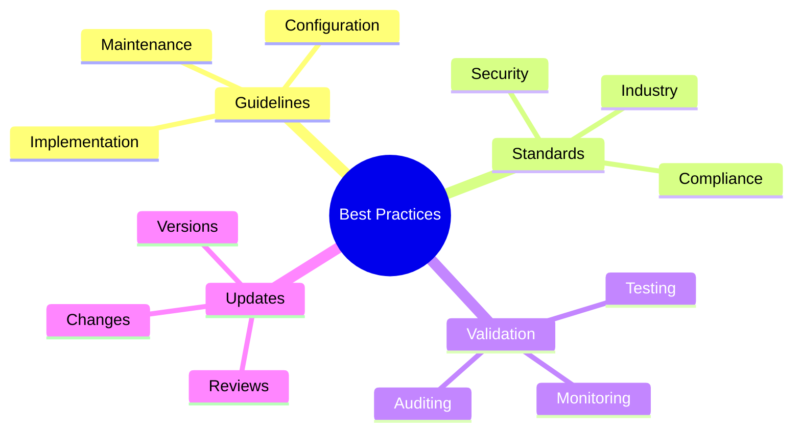
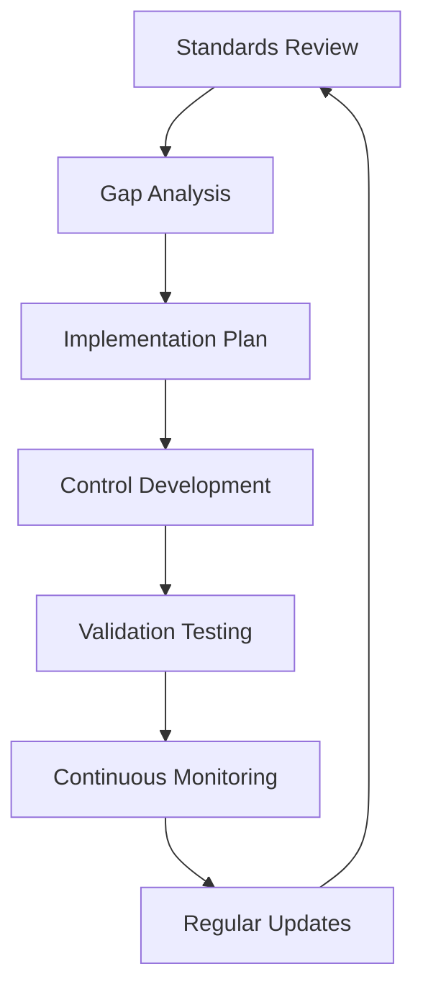

# Best Practices Template

This template is designed for security guidelines, standards, and best practices documentation on ZeroDaily.me.

## Purpose



## Frontmatter Structure

```yaml
---
title: 'Security Best Practices: Topic'
date: '2025-03-16'
# Required team attribution
authors: ['security-standards-team']  # Security Standards Team handles best practices

# Required tags for this team
tags: [
  'best-practices',  # Core tag for guidelines
  'guidelines',      # Required for standards
  'security',        # Domain focus
  'compliance'       # Standards focus
]

# Required fields for this team
frameworks: [          # Required framework mappings
  'NIST',             # Core frameworks
  'ISO27001',
  'CIS'
]
compliance: [          # Required compliance mappings
  'GDPR',             # Privacy standards
  'HIPAA',            # Healthcare standards
  'PCI-DSS'           # Payment standards
]
# Content verification (optional for best practices)
# last_verified_date: '2025-03-16'  # Optional for best practices content
maturity_level: 'established'   # Required maturity assessment

draft: true
summary: 'Comprehensive security guidelines and best practices for implementing and maintaining secure systems.'
estimated_read_time: 15
featured: false
related_resources: [
  '/resources/frameworks/security',
  '/resources/tools/compliance',
  '/resources/training/security-awareness'
]
---
```

## Content Structure

### 1. Overview
- Purpose
- Scope
- Requirements

## Content Examples

### Overview Example

#### Purpose
Define secure access control implementation standards for cloud infrastructure, focusing on authentication, authorization, and audit requirements for cloud services.

#### Scope
- Authentication mechanisms
- Authorization frameworks
- Access audit systems
- Monitoring solutions

#### Requirements
| Component | Purpose | Implementation |
|-----------|---------|----------------|
| Cloud IAM | Access management | Platform-specific IAM |
| MFA System | Authentication | Hardware/software tokens |
| Audit Tools | Monitoring | Log aggregation |
| SIEM | Analysis | Real-time alerting |

### Guidelines Example

#### 1. Authentication Setup
- Configure MFA for all accounts
- Set password policies
- Implement session management

#### 2. Authorization Rules
```yaml
# Role configuration
roles:
  admin:
    permissions: ['read', 'write', 'delete']
    mfa_required: true
    session_timeout: '30m'
    ip_restrictions: ['10.0.0.0/8']
  reader:
    permissions: ['read']
    mfa_required: false
    session_timeout: '1h'
    ip_restrictions: []
```

#### 3. Maintenance Schedule
| Task | Frequency | Description |
|------|-----------|-------------|
| Access Review | Weekly | Review active accounts and permissions |
| Role Audit | Monthly | Validate role configurations and usage |
| Policy Update | Quarterly | Update security policies and rules |

### 3. Standards Compliance

#### Overview
This section defines the mapping between security standards, their implementation, and validation requirements.

#### Industry Standards
Key security frameworks and standards that guide our implementation:

| Framework | Description | Primary Use |
|-----------|-------------|-------------|
| NIST | Comprehensive security controls | Government & Enterprise |
| ISO27001 | Information security management | Global organizations |
| CIS | Security configuration benchmarks | System hardening |

#### Control Matrix
Detailed mapping of security controls to implementation:

| Standard | Control ID | Requirement | Implementation | Validation |
|----------|------------|-------------|----------------|------------|
| NIST | AC-1 | Access Policy | Document policies | Quarterly review |
| NIST | AC-2 | Account Management | Lifecycle automation | Monthly audit |
| ISO27001 | A.9.1 | Access Control Policy | RBAC implementation | Weekly check |
| ISO27001 | A.9.2 | User Access | SSO integration | Daily monitoring |
| CIS | 1.1 | Asset Inventory | Automated tracking | Real-time sync |
| CIS | 1.2 | Access Control | Zero-trust model | Continuous verify |

#### Implementation Process


#### Validation Framework

1. Policy Validation
   - Documentation review
   - Compliance mapping
   - Gap assessment
   - Update tracking

2. Implementation Verification
   - Control testing
   - Configuration review
   - Integration validation
   - Performance impact

3. Continuous Assessment
   - Automated checks
   - Compliance monitoring
   - Incident tracking
   - Improvement cycle

4. Reporting Structure
   - Daily metrics
   - Weekly summaries
   - Monthly reviews
   - Quarterly assessments

### Validation Example

#### 1. Validation Interface
```typescript
interface SecurityCheck {
  id: string;
  name: string;
  type: 'automated' | 'manual';
  frequency: 'realtime' | 'daily' | 'weekly';
  thresholds: {
    warning: number;
    critical: number;
  };
  validation: {
    method: string;
    params: Record<string, unknown>;
  };
}

interface ValidationSuite {
  name: string;
  description: string;
  checks: SecurityCheck[];
  notifications: {
    slack?: string;
    email?: string[];
    webhook?: string;
  };
}
```

#### 2. Example Configuration
```yaml
validation_suites:
  access_control:
    name: "Access Control Validation"
    description: "Continuous validation of access control systems"
    checks:
      - id: "AC_MFA_001"
        name: "MFA Enforcement"
        type: "automated"
        frequency: "realtime"
        thresholds:
          warning: 95  # % of MFA compliance
          critical: 85
        validation:
          method: "mfa_check"
          params:
            required_methods: ["app", "hardware"]
            grace_period: "7d"
      
      - id: "AC_SESSION_001"
        name: "Session Management"
        type: "automated"
        frequency: "realtime"
        thresholds:
          warning: 30  # minutes of inactivity
          critical: 60
        validation:
          method: "session_check"
          params:
            max_duration: "4h"
            encryption: "required"
    
    notifications:
      slack: "#security-alerts"
      email: ["security@example.com"]
      webhook: "https://monitor.example.com/hooks/security"
```

#### 3. Monitoring Dashboard

| Metric | Warning | Critical | Current | Status |
|--------|---------|----------|---------|--------|
| MFA Compliance | 95% | 85% | 98% | ✅ |
| Session Duration | 30m | 60m | 25m | ✅ |
| Failed Logins | 3/min | 10/min | 1/min | ✅ |
| Token Validation | 50ms | 100ms | 45ms | ✅ |

#### 4. Alert Configuration

| Check | Condition | Action | Notification |
|-------|-----------|--------|--------------|
| MFA | < 95% | Auto-enable | Slack + Email |
| Session | > 30m | Force logout | Slack |
| Login | > 3/min | IP block | Slack + Webhook |
| Latency | > 50ms | Scale up | Webhook |

## UI Components

### 1. Compliance Checklist
```typescript
interface ComplianceItem {
  requirement: string;
  status: 'compliant' | 'partial' | 'non-compliant';
  evidence: string;
  lastChecked: string;
}
```

### 2. Framework Mapping
```typescript
interface FrameworkMapping {
  framework: string;
  controls: {
    id: string;
    requirement: string;
    implementation: string;
  }[];
}
```

## Writing Guidelines

### 1. Clarity
- Clear instructions
- Step-by-step guides
- Practical examples
- Implementation details

### 2. Compliance Focus
- Standard references
- Control mapping
- Validation steps
- Audit guidance

### 3. Maintenance
- Regular reviews
- Version tracking
- Change documentation
- Update procedures

## Validation Rules

### 1. Content Requirements
```typescript
interface GuidelineValidation {
  sections: {
    overview: boolean;
    implementation: boolean;
    compliance: boolean;
    validation: boolean;
  };
  compliance: {
    standards: string[];
    controls: string[];
  };
  review: {
    lastDate: string;
    frequency: string;
  };
}
```

### 2. Compliance Checklist
- Standard references
- Control mapping
- Evidence requirements
- Validation steps

## Examples

## Implementation Examples

### 1. Authentication Configuration
```yaml
authentication:
  mfa:
    required: true
    methods: ['app', 'hardware']
    grace_period: '7d'
  session:
    duration: '30m'
    inactivity: '5m'
    refresh_token: '7d'
  lockout:
    attempts: 3
    duration: '15m'
    notification: true
  password:
    min_length: 12
    complexity: true
    history: 24
```

### 2. Authorization Model
```typescript
interface AccessPolicy {
  role: string;
  permissions: {
    resource: string;
    actions: string[];
    conditions?: {
      timeWindow?: string;
      ipRange?: string[];
      mfaRequired?: boolean;
      riskScore?: number;
    };
  }[];
}

const adminPolicy: AccessPolicy = {
  role: 'admin',
  permissions: [
    {
      resource: 'secrets',
      actions: ['read', 'write'],
      conditions: {
        mfaRequired: true,
        ipRange: ['10.0.0.0/8'],
        riskScore: 0.2
      }
    },
    {
      resource: 'audit-logs',
      actions: ['read'],
      conditions: {
        timeWindow: '24h',
        mfaRequired: true
      }
    }
  ]
};
```

### 3. Control Implementation Matrix
| Control | Implementation | Validation | Monitoring |
|---------|----------------|------------|------------|
| AC-1 | Access Policy | Policy review | Policy violations |
| AC-2 | Account Lifecycle | Access audit | Account status |
| AC-3 | RBAC | Permission check | Access patterns |
| AC-4 | Data Flow | Flow validation | Data access |
| AC-5 | Separation | Duty conflicts | Role conflicts |

## Best Practices

### 1. Documentation
- Clear structure
- Regular updates
- Version control
- Change tracking

### 2. Implementation
- Practical guidance
- Real examples
- Validation steps
- Error handling

### 3. Compliance
- Standard mapping
- Control tracking
- Evidence collection
- Audit support

## Integration Notes

### 1. Platform Features
- Checklist tracking
- Compliance mapping
- Version control
- Update notifications

### 2. Content Validation
| Check | Description | Implementation |
|-------|-------------|----------------|
| Team | Author validation | Security Standards Team |
| Schema | Frontmatter validation | TypeScript types |
| Required Fields | Field presence | frameworks, compliance, maturity_level |
| Content Structure | Section validation | Guidelines, Implementation, Validation |
| Verification Status | Content verification tracking | last_verified_date |

### 3. Search Integration
| Feature | Implementation | Index Fields |
|---------|----------------|--------------|
| Standards Search | Elasticsearch | title, guidelines |
| Framework Filter | Faceted search | frameworks, compliance |
| Maturity Filter | Term aggregation | maturity level |
| Review Timeline | Date range | review dates, updates |
| Related Content | Vector similarity | content embeddings |

### 3. Analytics
| Metric | Purpose | Implementation |
|--------|---------|----------------|
| Framework Adoption | Standards tracking | Implementation metrics |
| Compliance Status | Standards adherence | Compliance monitoring |
| Review Coverage | Update tracking | Review history |
| Usage Patterns | Content effectiveness | Access analytics |
| Implementation Success | Guidelines adoption | Feedback tracking |

## Maintenance

### 1. Review Process
- Regular reviews
- Standard updates
- Implementation checks
- Feedback integration

### 2. Version Control
```yaml
version: '1.0.0'
changes:
  - date: '2025-03-16'
    type: 'update'
    description: 'Updated compliance controls'
```

### 3. Change Management
- Version tracking
- Change documentation
- Impact assessment
- Update notification
