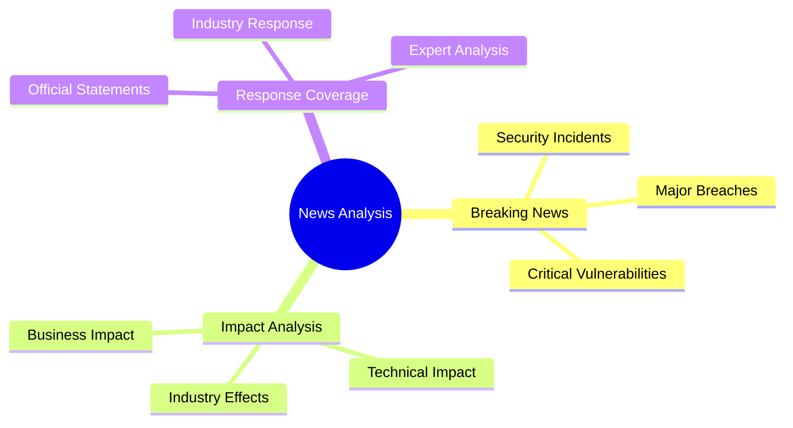

# News Analysis Template

This template is designed for breaking cybersecurity news and analysis articles on ZeroDaily.me.

## Purpose



## Frontmatter Structure

```yaml
---
title: 'Breaking News: Major Security Event'
date: '2025-03-16'
# Required team attribution
authors: ['threat-intelligence-team']  # Threat Intelligence Team handles news analysis

# Required tags for this team
tags: [
  'security-news',  # Core tag for news content
  'threat',         # Required for threat analysis
  'breach',         # Incident type
  'vulnerability'   # Technical focus
]

# Required fields for this team
confidence_level: 'high'     # Required confidence in analysis
threat_severity: 'critical'  # Required threat assessment
reporting_phase: 'initial'   # Required reporting stage

# Content verification (for current threat intelligence)
last_verified_date: '2025-03-16'  # ISO date format

draft: true
summary: 'A comprehensive analysis of the security event, its immediate impact, and potential long-term implications for the cybersecurity landscape.'
estimated_read_time: 10
featured: false
impact_level: 'critical' # Options: critical, high, medium, low
affected_sectors: [
  'technology',  # Primary affected sector
  'financial',   # Secondary impacts
  'healthcare'   # Additional impacts
]
related_resources: [
  '/resources/playbooks/incident-response',  # Related response guides
  '/resources/tools/threat-analysis',        # Relevant tools
  '/resources/training/security-awareness'   # Training materials
]
---
```

## Content Structure

### 1. Breaking News Overview
- Event summary
- Initial impact
- Key stakeholders

```markdown
# Breaking News Overview

Brief introduction to the security event, when it was discovered, and who reported it.

## Key Points
- Discovery timeline
- Affected systems/organizations
- Initial response measures
```

### 2. Technical Analysis
- Technical details
- Attack vectors
- Affected systems

```markdown
## Technical Analysis

### Affected Systems
- List affected software/systems
- Version numbers
- Components

### Attack Vector
Detailed technical explanation of the attack/incident.

### Current Status
Latest updates on the situation.
```

### 3. Impact Assessment
- Industry impact
- Technical implications
- Business effects

```markdown
## Impact Assessment

### Industry Impact
- Affected sectors
- Market response
- Regulatory implications

### Technical Impact
- System compromises
- Data exposure
- Service disruptions

### Business Impact
- Financial implications
- Operational effects
- Reputation impact
```

### 4. Response & Mitigation
- Official responses
- Industry reactions
- Mitigation steps

```markdown
## Response & Mitigation

### Official Statements
- Vendor response
- Government advisories
- Industry statements

### Mitigation Steps
1. Immediate actions
2. Short-term measures
3. Long-term recommendations
```

### 5. Expert Analysis
- Expert opinions
- Industry insights
- Future implications

```markdown
## Expert Analysis

### Industry Perspectives
Expert opinions and analysis from security professionals.

### Future Implications
Long-term impact and industry changes.
```

## UI Components

### 1. Timeline Component
```typescript
interface TimelineEvent {
  timestamp: string;
  event: string;
  details: string;
  importance: 'critical' | 'high' | 'normal';
}
```

### 2. Impact Display
```typescript
interface ImpactMetrics {
  severity: 'critical' | 'high' | 'medium' | 'low';
  scope: string[];
  timeline: string;
  status: 'ongoing' | 'contained' | 'resolved';
}
```

## Writing Guidelines

### 1. Style Requirements
- Clear, concise language
- Technical accuracy
- Factual reporting
- Balanced analysis

### 2. Content Quality
- Verified sources
- Multiple perspectives
- Technical depth
- Actionable insights

### 3. Update Process
- Regular updates
- Fact verification
- Status changes
- New developments

## Validation Rules

### 1. Required Sections
- Breaking news overview
- Technical analysis
- Impact assessment
- Response coverage
- Expert analysis

### 2. Content Validation
| Check | Description | Implementation |
|-------|-------------|----------------|
| Team | Author validation | Threat Intelligence Team |
| Schema | Frontmatter validation | TypeScript types |
| Required Fields | Field presence | confidence_level, threat_severity |
| Content Structure | Section validation | Timeline, Impact Analysis |
| Sources | Citation verification | Expert quotes, official statements |

## Examples

### 1. Breaking News Post
```markdown
# Breaking News: Major Cloud Provider Security Incident

A significant security breach has been detected affecting [Provider]'s infrastructure...

## Key Points
- Discovered on [Date]
- Affects [Systems]
- Current Status: [Status]
```

### 2. Impact Analysis
```markdown
## Impact Assessment

### Industry Impact
- Financial sector: High risk
- Healthcare: Data exposure
- Technology: Service disruptions

### Technical Details
- Affected services
- Compromise methods
- Current mitigations
```

## Best Practices

### 1. Research
- Multiple sources
- Expert verification
- Technical validation
- Impact assessment

### 2. Writing
- Clear structure
- Technical accuracy
- Regular updates
- Source attribution

### 3. Review Process
- Fact checking
- Technical review
- Editorial review
- Update verification

## Integration Notes

### 1. Platform Display
- Timeline visualization
- Impact metrics
- Update tracking
- Resource linking

### 2. Search Integration
| Feature | Implementation | Index Fields |
|---------|----------------|--------------|
| News Search | Elasticsearch | title, summary |
| Threat Filter | Faceted search | threat level, status |
| Sector Filter | Term aggregation | affected sectors |
| Timeline | Date range | event dates, updates |
| Related Content | Vector similarity | content embeddings |

### 3. Analytics
| Metric | Purpose | Implementation |
|--------|---------|----------------|
| Impact Level | Threat assessment | Severity tracking |
| Sector Coverage | Industry analysis | Sector mapping |
| Response Time | Breaking news | Update tracking |
| Engagement | Reader interaction | View metrics |
| Citations | Content reach | Reference tracking |
