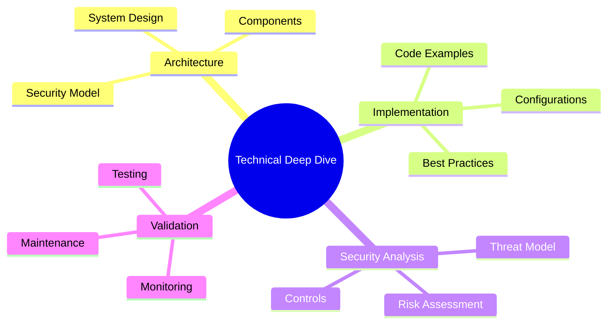
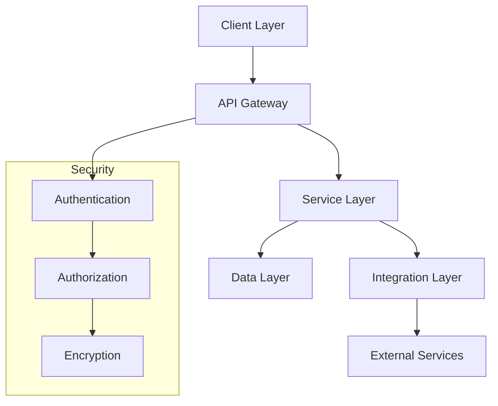

# Technical Deep Dive Template

This template is designed for in-depth technical analysis and implementation guides on ZeroDaily.me.

## Template Overview

### 1. Purpose
Provide comprehensive technical documentation that:
- Explains complex technical concepts
- Details implementation approaches
- Covers security considerations
- Includes validation methods

### 2. Document Structure


### 3. Required Sections
| Section | Purpose | Key Elements |
|---------|---------|-------------|
| Overview | Introduction | Problem, solution, architecture |
| Implementation | Technical guide | Setup, code, configuration |
| Security | Protection measures | Controls, threats, mitigations |
| Validation | Quality assurance | Tests, monitoring, maintenance |

## Frontmatter Example
```yaml
---
title: 'Technical Deep Dive: Zero Trust Implementation'
date: '2025-03-16'
# Required team attribution
authors: ['technical-analysis-team']  # Technical Analysis Team handles deep dives

# Required tags for this team
tags: 
  - deep-dive           # Core tag for technical analysis
  - technical           # Required for technical content
  - security-engineering # Implementation focus
  - architecture        # System design focus

# Required fields for this team
difficulty_level: 'advanced'  # Required for content complexity
prerequisites: 
  - 'security-fundamentals'  # Required background
  - 'system-architecture'    # Required knowledge
  - 'coding-experience'      # Required skills
series: 'zero-trust-architecture'  # Optional series grouping

draft: true
summary: 'In-depth technical analysis of zero trust architecture implementation, including system design, security controls, and validation methods.'
estimated_read_time: 25
featured: false
impact_level: 'high'
difficulty_level: 'advanced'
prerequisites:
  - 'Security architecture fundamentals'
  - 'OAuth 2.0 and OpenID Connect'
  - 'Infrastructure as Code'
affected_sectors:
  - 'technology'
  - 'infrastructure'
related_resources:
  - '/resources/frameworks/zero-trust'
  - '/resources/tools/security-testing'

# For verifiable technical content (required if this is a tool guide or implementation playbook)
# last_verified_date: '2025-03-16'  # ISO date format
summary: 'In-depth technical analysis of zero trust architecture implementation, including system design, security controls, and validation methods.'
estimated_read_time: 25
featured: true
difficulty_level: 'advanced'
prerequisites:
  - security-fundamentals
  - cloud-architecture
  - identity-management
series: zero-trust-series
related_resources:
  - /resources/frameworks/zero-trust
  - /resources/tools/identity-platform
  - /resources/training/security-implementation
---
```

## Content Structure

### 1. Technical Overview

#### Background
Provide a comprehensive introduction to the technical topic, including:
- Problem statement and context
- Current challenges and limitations
- Proposed solution approach
- Expected outcomes and benefits

#### Architecture Overview


#### System Components
| Component | Purpose | Implementation | Security |
|-----------|---------|----------------|----------|
| Client | User interface | React/TypeScript | CSP, CORS |
| Gateway | API management | Kong/Nginx | WAF, Rate limiting |
| Service | Business logic | Node.js/Go | Input validation |
| Data | Storage | PostgreSQL | Encryption at rest |

#### Integration Points
| Service | Protocol | Authentication | Rate Limit |
|---------|-----------|----------------|------------|
| API Gateway | HTTPS | JWT + MFA | 1000/min |
| Database | TLS | Certificate | 100/sec |
| Cache | TLS | Password | 500/sec |
| External | HTTPS | OAuth2 | 100/min |

### 2. System Implementation

#### Component Details
| Component | Role | Integration Points | Security Features |
|-----------|------|-------------------|------------------|
| Frontend | User interface | API Gateway | CSP, CORS |
| Backend | Business logic | Database, Cache | Input validation |
| Database | Data storage | Backend | Encryption at rest |
| Cache | Performance | Backend | Access control |

#### Technical Requirements
| Category | Requirement | Version | Purpose |
|----------|-------------|----------|----------|
| Runtime | Node.js | >= 18.x | Application server |
| Database | PostgreSQL | >= 14.x | Data persistence |
| Cache | Redis | >= 6.x | Performance optimization |
| Tools | Docker | Latest | Containerization |
| Tools | Kubernetes | Latest | Orchestration |

#### Deployment Process
```bash
# 1. Environment Setup
yarn install
cp .env.example .env

# 2. Security Configuration
openssl req -newkey rsa:4096 -nodes -keyout private.key -out cert.csr
kubectl create secret tls app-tls --key private.key --cert cert.crt

# 3. Service Deployment
docker-compose up -d
kubectl apply -f k8s/

# 4. Validation
kubectl get pods
kubectl logs -f deployment/app
```

#### Configuration Reference
```yaml
# Application Configuration
app:
  name: technical-service
  version: 1.0.0
  environment: production

# Security Settings
security:
  # Authentication Configuration
  authentication:
    provider: oauth2
    mfa:
      required: true
      methods: ['app', 'hardware']
      grace_period: '7d'
    session:
      timeout: '30m'
      refresh: true
      max_duration: '8h'
  
  # Authorization Settings
  authorization:
    model: rbac
    default_role: reader
    admin:
      requires_mfa: true
      ip_whitelist: true
    audit:
      enabled: true
      retention: '90d'
  
  # Encryption Configuration
  encryption:
    algorithm: AES-256-GCM
    key_management:
      rotation: '90d'
      backup: true
      hsm_enabled: true
    scope:
      at_rest: true
      in_transit: true
      in_memory: true

# Monitoring Configuration
monitoring:
  # Metrics Collection
  metrics:
    provider: prometheus
    interval: '15s'
    retention: '30d'
    exporters:
      - name: node_exporter
        port: 9100
      - name: app_metrics
        port: 9090
  
  # Logging Setup
  logging:
    level: info
    format: json
    fields:
      - timestamp
      - severity
      - trace_id
      - component
  
  # Alert Configuration
  alerts:
    channels:
      slack: '#security-alerts'
      email: 'security@example.com'
      pagerduty: true
    severity_levels:
      - critical: 5m
      - high: 15m
      - medium: 1h

### 3. Security Analysis

#### Threat Model
| Threat | Vector | Impact | Mitigation |
|--------|---------|---------|------------|
| Data Breach | API Endpoint | Critical | Input validation, encryption |
| Auth Bypass | Token Theft | High | MFA, short TTL |
| DoS | API Flooding | Medium | Rate limiting, CDN |

#### Security Controls
```typescript
interface SecurityConfig {
  authentication: {
    provider: 'oauth2' | 'oidc';
    mfa: {
      required: boolean;
      methods: string[];
      grace_period?: string;
    };
    session: {
      duration: string;
      refresh_token: boolean;
      inactivity_timeout: string;
    };
  };
  authorization: {
    model: 'rbac' | 'abac';
    policies: Array<{
      role: string;
      resources: string[];
      actions: string[];
      conditions?: Record<string, unknown>;
    }>;
  };
  encryption: {
    algorithm: string;
    key_management: {
      rotation: string;
      backup: boolean;
    };
    scope: {
      at_rest: boolean;
      in_transit: boolean;
      in_memory: boolean;
    };
  };
}
```

#### Best Practices
1. Authentication
   - Enforce MFA for all privileged access
   - Implement proper session management
   - Use secure token storage

2. Authorization
   - Follow principle of least privilege
   - Implement role-based access control
   - Regular access reviews

3. Data Protection
   - Encrypt sensitive data at rest
   - Use TLS 1.3 for transit
   - Implement proper key management

### 4. Validation & Testing

#### Test Strategy
| Type | Scope | Tools | Coverage Target |
|------|-------|-------|----------------|
| Unit | Functions | Jest | 90% |
| Integration | Services | Cypress | 85% |
| Security | System | OWASP ZAP | All critical paths |

#### Monitoring Setup
```yaml
monitoring:
  metrics:
    - name: response_time
      type: histogram
      labels: [endpoint, method]
      buckets: [10, 50, 100, 200, 500]
    - name: error_rate
      type: counter
      labels: [type, severity]
    - name: security_events
      type: counter
      labels: [category, impact]
  
  alerts:
    - name: high_error_rate
      condition: error_rate > 1%
      duration: 5m
      severity: critical
    - name: response_latency
      condition: response_time_p95 > 200ms
      duration: 10m
      severity: warning
    - name: security_incident
      condition: security_events > 0
      duration: 1m
      severity: critical

  dashboards:
    - name: service_health
      panels: [errors, latency, throughput]
    - name: security_overview
      panels: [auth_failures, threats, incidents]
```

#### Maintenance Schedule
| Task | Frequency | Description | Owner |
|------|-----------|-------------|--------|
| Security Scan | Daily | Vulnerability assessment | Security Team |
| Dependency Update | Weekly | Update packages | DevOps |
| Performance Review | Monthly | System optimization | Engineering |
| DR Test | Quarterly | Recovery validation | Operations |
## Platform Integration

### 1. Content Display
| Component | Purpose | Implementation |
|-----------|---------|----------------|
| Code Blocks | Syntax highlighting | Prism.js + theme |
| Diagrams | Architecture visualization | Mermaid renderer |
| Tables | Data presentation | Responsive grid |
| Metadata | Content organization | Frontmatter parser |

### 2. UI Components
```typescript
// Code Display Configuration
interface CodeBlockConfig {
  language: string;                // Programming language
  theme: 'light' | 'dark';         // Color theme
  features: {
    lineNumbers: boolean;          // Show line numbers
    highlightLines: number[];      // Lines to highlight
    copyButton: boolean;           // Enable copy button
    showLanguage: boolean;         // Show language label
  };
  validation?: {
    linting: boolean;             // Enable linting
    execution: boolean;            // Allow execution
    sandboxed: boolean;           // Run in sandbox
  };
}

// Diagram Configuration
interface DiagramConfig {
  type: 'flowchart' | 'sequence' | 'class' | 'mindmap';
  theme: {
    style: 'default' | 'forest' | 'dark';
    customColors?: Record<string, string>;
  };
  features: {
    interactive: boolean;          // Enable interactions
    pan: boolean;                  // Allow panning
    zoom: boolean;                 // Allow zooming
    fullscreen: boolean;           // Fullscreen option
  };
  export?: {
    formats: ('png' | 'svg' | 'pdf')[];
    quality: number;
  };
}
```

### 3. Content Validation
| Check | Description | Implementation |
|-------|-------------|----------------|
| Schema | Frontmatter validation | TypeScript types |
| Links | URL verification | HTTP checker |
| Code | Syntax validation | Language parsers |
| Security | Content scanning | Security rules |

### 4. Search Integration
| Feature | Implementation | Index Fields |
|---------|----------------|--------------|
| Full Text | Elasticsearch | title, content |
| Code Search | Language parser | code blocks |
| Metadata | Field indexing | frontmatter |
| Related Content | Vector similarity | embeddings |

## Writing Guidelines

### 1. Content Structure
- Use clear hierarchy with proper heading levels
- Include detailed code examples with comments
- Provide architecture diagrams for complex systems
- Add tables for structured data presentation

### 2. Code Examples
- Include complete, runnable code snippets
- Add inline comments for complex logic
- Show both basic and advanced usage
- Provide error handling examples

### 3. Security Considerations
- Never include sensitive data or credentials
- Use placeholder values for secrets
- Document security best practices
- Include security validation steps

## Quality Standards

### 1. Content Requirements
| Category | Requirements | Validation |
|----------|--------------|------------|
| Structure | All required sections | Schema check |
| Code Examples | Minimum 3 per topic | Parser check |
| Diagrams | System architecture | Mermaid render |
| Security | Controls and validation | Security scan |

### 2. Technical Standards
| Aspect | Requirements | Implementation |
|--------|--------------|----------------|
| Code Quality | Clean, documented | Linter rules |
| Architecture | Component isolation | Design review |
| Security | Zero trust model | Security audit |
| Performance | SLO compliance | Load testing |

### 3. Documentation Rules
```typescript
// Content Validation Schema
interface ContentValidation {
  // Required Sections
  sections: {
    overview: boolean;      // Technical background
    architecture: boolean;  // System design
    implementation: boolean;// Code examples
    security: boolean;      // Security controls
    validation: boolean;    // Testing strategy
  };

  // Code Requirements
  codeExamples: {
    minCount: number;      // Minimum examples
    languages: string[];   // Supported languages
    validation: {
      linting: boolean;    // Code style check
      security: boolean;   // Security scan
      runnable: boolean;   // Execution test
    };
  };

  // Visual Elements
  diagrams: {
    architecture: boolean; // System overview
    dataFlow: boolean;    // Data movement
    security: boolean;    // Security model
    validation?: {
      render: boolean;    // Mermaid check
      style: boolean;     // Theme compliance
    };
  };

  // Security Guidelines
  security: {
    threatModel: boolean;  // Risk analysis
    controls: boolean;     // Security measures
    validation: boolean;   // Security testing
    compliance?: {
      standards: string[]; // Security standards
      audit: boolean;      // Compliance check
    };
  };
}
```

### 4. Example Implementations

#### Architecture Pattern
```typescript
// Secure Service Configuration
interface ServiceConfig {
  // Service Identity
  service: {
    name: string;
    version: string;
    environment: 'development' | 'staging' | 'production';
  };

  // Security Settings
  security: {
    // Authentication
    auth: {
      provider: 'oauth2' | 'oidc';
      mfa: {
        required: boolean;
        methods: string[];
      };
    };

    // Authorization
    rbac: {
      model: 'role' | 'attribute';
      defaultRole: string;
      adminMfa: boolean;
    };

    // Encryption
    encryption: {
      atRest: boolean;
      inTransit: boolean;
      keyRotation: string;
    };
  };

  // Monitoring
  observability: {
    metrics: {
      provider: string;
      interval: string;
    };
    logging: {
      level: string;
      format: string;
    };
    alerts: {
      channels: string[];
      severity: string[];
    };
  };
}
```

#### Implementation Steps
```bash
# 1. Environment Setup
yarn add @security/core @validation/schema

# 2. Security Configuration
openssl req -newkey rsa:4096 -nodes -keyout private.key -out cert.csr

# 3. Service Deployment
docker-compose up -d
kubectl apply -f k8s/

# 4. Validation
kubectl get pods
kubectl logs -f deployment/app
```

## Security Framework

### 1. Security Controls
| Category | Implementation | Validation |
|----------|----------------|------------|
| Authentication | OAuth2 + MFA | Token tests |
| Authorization | RBAC/ABAC | Permission checks |
| Encryption | AES-256-GCM | Key management |
| Network | TLS 1.3 | Security scan |

### 2. Compliance Matrix
| Standard | Requirements | Validation |
|----------|--------------|------------|
| OWASP | Top 10 controls | Security scan |
| NIST | Security framework | Risk assessment |
| SOC2 | Security controls | Audit logs |
| ISO27001 | Security policies | Compliance check |

### 3. Security Validation
```typescript
// Security Test Schema
interface SecurityValidation {
  // Authentication
  auth: {
    oauth: boolean;      // OAuth2 flow
    mfa: boolean;        // MFA enforcement
    session: boolean;    // Session management
  };

  // Authorization
  rbac: {
    roles: boolean;      // Role checks
    permissions: boolean; // Permission validation
    audit: boolean;      // Access logs
  };

  // Data Protection
  encryption: {
    atRest: boolean;     // Storage security
    inTransit: boolean;  // TLS validation
    secrets: boolean;    // Secret management
  };
}
```

## Platform Integration

### 1. Content Display
| Feature | Implementation | Platform |
|---------|----------------|----------|
| Code Blocks | Prism.js | ZeroDaily |
| Diagrams | Mermaid | ZeroDaily |
| Tables | MDX | ZeroDaily |
| Interactive | React | ZeroDaily |

### 2. Search Features
| Feature | Implementation | Index Fields |
|---------|----------------|--------------|
| Full Text | Elasticsearch | content, title |
| Code Search | AST parser | code blocks |
| Topics | Vector DB | embeddings |
| Related | Graph DB | relationships |

### 3. Analytics
| Metric | Purpose | Implementation |
|--------|---------|----------------|
| Code Usage | Implementation tracking | Code block analysis |
| Architecture | Design adoption | Component metrics |
| Security Controls | Control implementation | Security tracking |
| Documentation | Guide effectiveness | Reader analytics |
| Technical Impact | Solution adoption | Implementation feedback |
