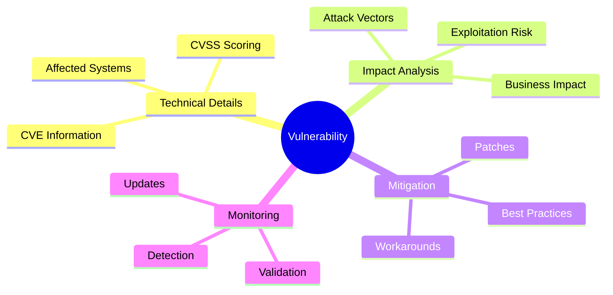

# Vulnerability Analysis Template

This template is designed for comprehensive vulnerability analysis, CVE reports, and security advisories on ZeroDaily.me.

## Purpose



## Frontmatter Structure

```yaml
---
title: '[CVE-YYYY-XXXXX] Critical Vulnerability Title'
date: '2025-03-16'
tags: ['vulnerability', 'exploit', 'cve']
draft: true
summary: 'Comprehensive analysis of a critical vulnerability, including technical details, impact assessment, exploitation risks, and mitigation strategies.'
# Required team attribution
authors: ['security-research-team']  # Security Research Team handles vulnerability analysis

# Required tags for this team
tags: [
  'vulnerability',  # Core tag for vuln analysis
  'cve',           # Required for CVE reports
  'exploit',       # Attack vector details
  'security'       # General category
]

# Required fields for this team
cvss_score: 9.8        # Required for vulnerability severity
related_cves: [        # Required for tracking related vulns
  'CVE-2025-12345',
  'CVE-2025-12346'
]
affected_versions: [   # Required for version tracking
  '1.0.0 - 1.2.3',
  '2.0.0 - 2.1.0'
]

# Content verification (required for vulnerability reports)
last_verified_date: '2025-03-16'  # ISO date format
estimated_read_time: 12
featured: false
impact_level: 'critical' # Options: critical, high, medium, low
cvss_score: 9.8 # CVSS score if applicable
related_cves: ['CVE-YYYY-XXXXX'] # Related vulnerabilities
affected_sectors: [
  'technology',     # Primary affected sector
  'infrastructure', # Secondary impacts
  'financial'       # Additional impacts
]
related_resources: [
  '/resources/playbooks/vulnerability-response',  # Response procedures
  '/resources/tools/vulnerability-assessment',    # Assessment tools
  '/resources/frameworks/vulnerability-scoring'   # CVSS framework
]
---
```

## Content Structure

### 1. Overview
- Vulnerability summary
- CVSS breakdown
- Affected systems

```markdown
# Overview

Brief introduction to the vulnerability, when it was discovered, and who reported it.

## CVSS Breakdown
- Base Score: 9.8
- Vector: CVSS:3.1/AV:N/AC:L/PR:N/UI:N/S:U/C:H/I:H/A:H
- Temporal Score: [if applicable]
- Environmental Score: [if applicable]
```

### 2. Technical Details

#### Affected Components
| Component | Version | Status |
|-----------|---------|--------|
| Software | x.y.z | Vulnerable |
| Framework | a.b.c | Affected |
| Library | m.n.p | At Risk |

#### Vulnerability Description
```typescript
// Example of vulnerable code
function processUserInput(input: string) {
  // Missing input validation
  const query = `SELECT * FROM users WHERE id = ${input}`;
  return executeQuery(query);
}
```

#### Technical Analysis
| Category | Details | Impact |
|----------|---------|--------|
| Root Cause | Input validation | Data exposure |
| Trigger | Malformed request | Service crash |
| Complexity | Low | Easy exploit |

### 3. Attack Vectors

#### Exploitation Methods
| Method | Prerequisites | Complexity |
|--------|--------------|------------|
| Remote Code Execution | Network access | High |
| SQL Injection | Web interface | Medium |
| XSS Attack | User interaction | Low |

#### Attack Scenarios

##### Scenario One: Remote Exploitation
1. **Prerequisites**
   - Network connectivity
   - Valid user credentials
   - Target service running

2. **Attack Flow**
   ```bash
   # Example exploitation steps
   curl -X POST https://target.com/api/endpoint \
     -H 'Content-Type: application/json' \
     -d '{"payload": "malicious_input"}'
   ```

3. **Impact**
   - Unauthorized access
   - Data exfiltration
   - Service compromise

##### Scenario Two: Local Privilege Escalation
1. **Prerequisites**
   - Local user access
   - Vulnerable service version
   - Default configuration

2. **Attack Flow**
   ```python
   # Example privilege escalation
   def exploit_vulnerability():
       payload = construct_payload()
       trigger_vulnerability(payload)
       escalate_privileges()
   ```

3. **Impact**
   - Root access
   - System compromise
   - Persistent access

### 4. Impact Assessment

#### Security Impact Matrix
| Category | Severity | Description |
|----------|----------|-------------|
| Confidentiality | High | Sensitive data exposure |
| Integrity | Medium | Data manipulation risk |
| Availability | Low | Service disruption |

#### Business Impact Analysis
| Area | Impact | Mitigation Priority |
|------|--------|-------------------|
| Operations | Service downtime | Critical |
| Data | Information leak | High |
| Compliance | Regulatory breach | Medium |

#### Risk Assessment
| Factor | Rating | Justification |
|--------|--------|---------------|
| Exploitability | High | Public exploit available |
| Complexity | Low | Minimal skills required |
| Scope | Wide | Multiple systems affected |

### 5. Mitigation Strategy

#### Official Patches
| Vendor | Patch Version | Release Date |
|--------|---------------|--------------|
| Vendor A | 2.0.1 | 2025-03-15 |
| Vendor B | 3.1.4 | 2025-03-14 |
| Vendor C | 1.9.2 | 2025-03-13 |

#### Temporary Workarounds

##### Workaround One: Network Isolation
```bash
# Example firewall rules
iptables -A INPUT -p tcp --dport 443 -s trusted-ip -j ACCEPT
iptables -A INPUT -p tcp --dport 443 -j DROP

# Update configuration
sed -i 's/allow_remote=true/allow_remote=false/' /etc/service/config
```

##### Workaround Two: Access Control
```yaml
# Security configuration
security:
  authentication:
    require_mfa: true
    session_timeout: 15m
    failed_attempts: 3
  authorization:
    enforce_rbac: true
    default_deny: true
  monitoring:
    audit_logging: true
    alert_threshold: low
```

#### Validation Steps
| Step | Command | Expected Result |
|------|---------|----------------|
| Patch Check | `rpm -q package` | Version ≥ 2.0.1 |
| Config Test | `service test` | All checks pass |
| Security Scan | `security-tool` | No vulnerabilities |

## Platform Integration

### 1. UI Components
```typescript
// CVSS Score Display
interface CVSSComponent {
  // Base Metrics
  base: {
    score: number;                 // Base CVSS score
    vector: string;               // CVSS vector string
    severity: VulnerabilitySeverity;
    metrics: {
      attackVector: CVSSMetric;   // Network, Adjacent, Local, Physical
      complexity: CVSSMetric;     // Low, High
      privileges: CVSSMetric;     // None, Low, High
      userInteraction: CVSSMetric;// None, Required
      scope: CVSSMetric;         // Unchanged, Changed
      confidentiality: CVSSMetric;// None, Low, High
      integrity: CVSSMetric;     // None, Low, High
      availability: CVSSMetric;  // None, Low, High
    };
  };

  // Temporal Metrics (Optional)
  temporal?: {
    score: number;
    metrics: {
      exploitCode: CVSSMetric;    // Not Defined, High, Functional, Proof-of-Concept, Unproven
      remediationLevel: CVSSMetric;// Not Defined, Unavailable, Workaround, Temporary Fix, Official Fix
      reportConfidence: CVSSMetric;// Not Defined, Confirmed, Reasonable, Unknown
    };
  };

  // Environmental Metrics (Optional)
  environmental?: {
    score: number;
    metrics: {
      modifiedBase: BaseMetrics;  // Modified base metrics
      securityRequirements: {
        confidentiality: CVSSMetric;
        integrity: CVSSMetric;
        availability: CVSSMetric;
      };
    };
  };
}

// Vulnerability Timeline Display
interface TimelineComponent {
  events: Array<{
    type: TimelineEventType;      // Discovery, Disclosure, Patch, Exploit
    date: string;                 // ISO date string
    details: string;              // Event description
    severity: VulnerabilitySeverity;
    links?: Array<{
      url: string;
      title: string;
      type: 'patch' | 'advisory' | 'exploit' | 'mitigation';
    }>;
  }>;
  display: {
    style: 'timeline' | 'calendar' | 'list';
    groupBy: 'month' | 'quarter' | 'year';
    showDetails: boolean;
  };
}
```

### 2. Search Integration
| Feature | Implementation | Index Fields |
|---------|----------------|--------------|
| CVE Search | Elasticsearch | CVE ID, description |
| CVSS Filter | Faceted search | Base score, metrics |
| Vendor Filter | Term aggregation | Affected vendors |
| Timeline | Date range | Event dates |

### 3. Content Display
| Component | Purpose | Implementation |
|-----------|---------|----------------|
| CVSS Calculator | Score computation | Interactive form |
| Timeline View | Event tracking | Interactive chart |
| Code Blocks | Vulnerability examples | Syntax highlighting |
| Diagrams | Attack visualization | Mermaid renderer |

## Content Guidelines

### 1. Technical Requirements
| Category | Requirements | Validation |
|----------|--------------|------------|
| Accuracy | Verified info | Peer review |
| CVSS | Accurate scoring | CVSS calculator |
| Code | Working examples | Test execution |
| Patches | Tested fixes | Lab validation |

### 2. Documentation Standards
| Aspect | Guidelines | Implementation |
|--------|------------|----------------|
| Structure | Clear hierarchy | Section compliance |
| Examples | Practical demos | Code validation |
| References | Trusted sources | Link verification |
| Updates | Version tracking | Change monitoring |

### 3. Disclosure Policy
| Stage | Requirements | Stakeholders |
|-------|--------------|--------------|
| Initial | Vendor notification | Security team |
| Private | Patch development | Development team |
| Public | Advisory release | Community |
| Updates | Patch verification | Operations team |

### 4. Content Validation
| Check | Description | Implementation |
|-------|-------------|----------------|
| Team | Author validation | Security Research Team |
| Schema | Frontmatter validation | TypeScript types |
| Required Fields | Field presence | cve_id, cvss_score, affected_versions |
| Technical Accuracy | Content validation | CVSS calculation, code examples |
| Disclosure Status | Stage verification | Initial, Private, Public, Updates |


## Validation Framework

### 1. Content Requirements
```typescript
// Vulnerability Content Schema
interface ContentRequirements {
  // Required Metadata
  metadata: {
    cveId: {
      pattern: /^CVE-\d{4}-\d{4,}$/;
      required: true;
    };
    cvssScore: {
      min: 0;
      max: 10;
      required: true;
    };
    affectedVersions: {
      minItems: 1;
      format: 'semver';
      required: true;
    };
  };

  // Technical Content
  technical: {
    vulnerability: {
      description: boolean;    // Clear explanation
      rootCause: boolean;      // Technical cause
      affectedSystems: boolean;// Impact scope
    };
    exploitation: {
      prerequisites: boolean;  // Required access
      complexity: boolean;     // Attack difficulty
      reliability: boolean;    // Success rate
    };
    mitigation: {
      patches: boolean;        // Official fixes
      workarounds: boolean;    // Temporary fixes
      validation: boolean;     // Fix verification
    };
  };

  // Documentation Quality
  quality: {
    structure: {
      sections: string[];     // Required sections
      formatting: boolean;     // Markdown compliance
      diagrams: boolean;       // Visual aids
    };
    content: {
      technical: boolean;      // Technical accuracy
      practical: boolean;      // Actionable steps
      complete: boolean;       // All required info
    };
    references: {
      sources: boolean;        // Trusted links
      updates: boolean;        // Latest info
      tracking: boolean;       // Version control
    };
  };
}
```

### 2. Example Templates

#### CVE Report Structure
```yaml
# [CVE-2025-12345] Critical RCE Vulnerability

## Vulnerability Details
title: Remote Code Execution in Service X
cvss:
  base_score: 9.8
  vector: CVSS:3.1/AV:N/AC:L/PR:N/UI:N/S:U/C:H/I:H/A:H
  temporal_score: 8.9
affected_versions:
  - name: Service X
    versions: '>=2.0.0 <2.0.8'
    fixed_in: '2.0.8'
  - name: Library Y
    versions: '>=1.0.0 <1.2.0'
    fixed_in: '1.2.0'

## Technical Analysis
root_cause: Input validation bypass in API endpoint
exploit_complexity: Low (publicly available exploit)
impact:
  - Remote code execution
  - System compromise
  - Data exfiltration

## Mitigation Strategy
patches:
  - version: '2.0.8'
    url: https://vendor.com/patches/2.0.8
    hash: sha256:abc123...
workarounds:
  - title: API Access Control
    description: Restrict API access to trusted IPs
    configuration: |
      # Update security settings
      security.api.access = restricted
      security.api.allowed_ips = ['trusted-ip-1', 'trusted-ip-2']
```

### 3. Integration Points
| Component | Purpose | Implementation |
|-----------|---------|----------------|
| CVE Search | Vulnerability lookup | Elasticsearch |
| CVSS Calculator | Risk assessment | Interactive form |
| Code Highlighter | Example display | Prism.js |
| Diagram Renderer | Attack visualization | Mermaid |

### 4. Quality Checklist
| Category | Requirements | Validation |
|----------|--------------|------------|
| Technical | Accurate details | Expert review |
| Practical | Working solutions | Lab testing |
| Complete | All sections | Template check |
| Integrated | Platform support | Display test |

## Platform Integration Guide

### 1. Component Integration
```typescript
// Platform Component Configuration
interface PlatformConfig {
  // Search Configuration
  search: {
    indices: {
      cve: string;           // CVE search index
      vendor: string;        // Vendor index
      timeline: string;      // Event timeline index
    };
    filters: {
      cvss: {
        min: number;         // Minimum CVSS score
        max: number;         // Maximum CVSS score
        vector: string[];    // CVSS vector components
      };
      dates: {
        discovery: Date;     // Discovery date range
        disclosure: Date;    // Disclosure date range
        patched: Date;       // Patch release date range
      };
      status: {
        patched: boolean;    // Patch availability
        exploited: boolean;  // Active exploitation
        disclosed: boolean;  // Public disclosure
      };
    };
  };

  // Display Components
  display: {
    cvss: {
      calculator: boolean;   // CVSS score calculator
      chart: boolean;        // Risk visualization
      history: boolean;      // Score history
    };
    code: {
      highlight: boolean;    // Syntax highlighting
      diff: boolean;         // Patch diff view
      sandbox: boolean;      // Safe code execution
    };
    timeline: {
      view: string;         // Display mode
      events: string[];     // Event types to show
      grouping: string;     // Time grouping
    };
  };

### 2. Analytics
| Metric | Purpose | Implementation |
|--------|---------|----------------|
| CVSS Impact | Severity tracking | Score analytics |
| Patch Status | Fix verification | Download tracking |
| Disclosure Phase | Stage tracking | Timeline analytics |
| Vendor Response | Response tracking | Update metrics |
| Research Impact | Content reach | Citation tracking |

### 3. Integration Requirements
| Component | Purpose | Dependencies |
|-----------|---------|--------------|
| Search | Vulnerability discovery | Elasticsearch |
| Display | Content rendering | React components |
| Analytics | Usage tracking | Monitoring stack |
| Security | Access control | Auth service |

### 3. Platform Features
| Feature | Implementation | Status |
|---------|----------------|--------|
| CVSS Calculator | Interactive form | Active |
| Timeline View | React component | Active |
| Code Display | Prism.js | Active |
| Search Engine | Elasticsearch | Active |
